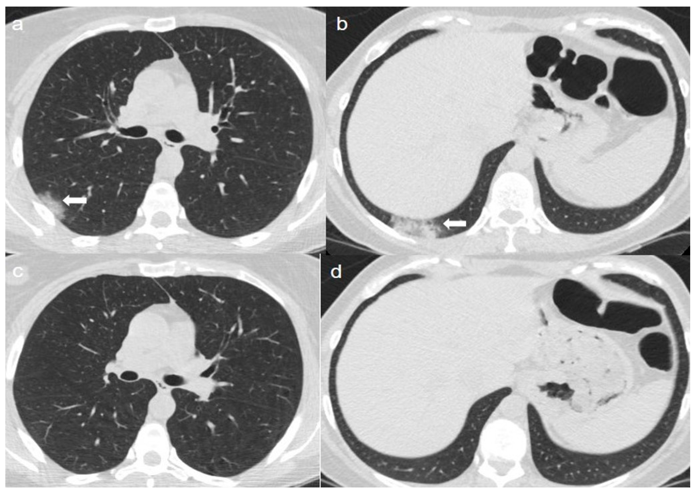

# COVID-19 Detection using VGG16 (Transfer Learning)

This project aims to detect COVID-19 from CT scan images using the VGG16 architecture and transfer learning. The primary intent behind using transfer learning is to harness the features learned from large datasets (like ImageNet) and apply them to the specific dataset in this project.




## Algorithm Overview

The VGG16 architecture is a convolutional neural network model for large-scale image recognition. It's one of the models from the VGG group at Oxford and is designed to recognize images in 1000 classes.

In this project:

1. The VGG16 model is loaded with weights pre-trained on ImageNet.
2. The top layers, which are responsible for classification, are removed.
3. Custom layers are added to adapt the model to the specific task of distinguishing between COVID and non-COVID CT images.
4. Only the custom layers are trained, ensuring the weights of the original VGG16 layers remain unchanged.

Using transfer learning in such a manner has multiple advantages:
- Training is faster as we don't have to train all the layers.
- The model can benefit from the generic features learned on a large dataset.
- It is more resource-efficient, especially when the available dataset is not large enough to train a deep model from scratch.

## Dataset

The dataset consists of CT scan images labeled as positive (with COVID-19) and negative (without COVID-19). The data is split into a training set and a test set using a 90-10 split.

## Dependencies
- Python 3.x
- TensorFlow
- Keras
- OpenCV
- Matplotlib
- Pandas
- OS, Glob, and Shutil

## Usage

1. Clone this repository:
\```bash
git clone https://github.com/A8neyestani/COVID19-Detection-VGG16.git
\```
2. Navigate to the directory:
\```bash
cd COVID19-Detection-VGG16
\```
3. Run the script:
\```bash
python covid19_detection_vgg16.py
\```

## Results

After training, the model's accuracy and loss for both training and validation sets can be visualized. The plots can be found in the results section of the repository.

## Author

**Arman Neyestani**  
- 🌐 GitHub: [A8neyestani](https://github.com/A8neyestani)
- 📧 Email: A8neyestani@protonmail.com

Feel free to reach out to me for any questions, suggestions, or collaboration!
